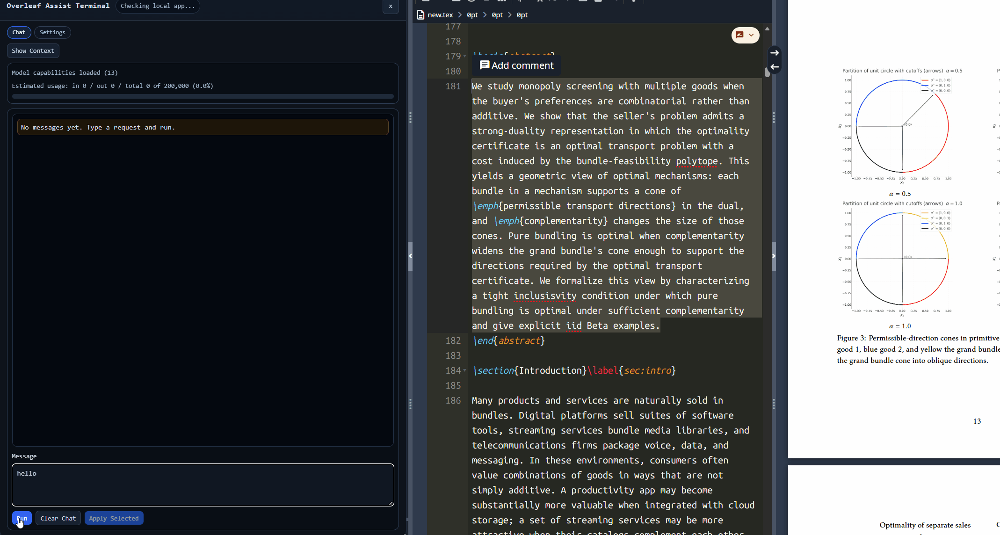

# Overleaf Assist Demo

Overleaf Assist connects Overleaf to your local Codex CLI through a small desktop app and browser userscript. It lets you prompt Codex from inside Overleaf, restore prior results when you reopen a project, and review shared project sessions from the desktop app.

## What This App Includes

- `overleaf-assist-demo.user.js`: the Tampermonkey userscript injected into Overleaf
- `desktop/main.js`: the Electron desktop host with tray controls, diagnostics, and session management
- `proxy/server.js`: the local bridge entrypoint used by the desktop app

## Quick Start

This is the recommended setup for normal use.

1. Install Tampermonkey in your browser.
2. Create a new userscript and paste in `overleaf-assist-demo.user.js`.
3. Install and launch the desktop app.
   - If you already have a packaged release, install the `.exe` from `dist/`.
   - If you are running from source, use the instructions in `Running From Source` below.
4. Make sure Codex CLI is installed and logged in.
   - `codex --version`
   - `codex login`
   - On Windows PowerShell with script-policy restrictions, use `codex.cmd` instead of `codex`.
5. Open an Overleaf project.
6. Open the assistant panel.
   - It should appear automatically.
   - If needed, toggle it with `Ctrl+Alt+Shift+A`.
7. Type a prompt and send it.
8. Review the answer in the Overleaf panel, then apply edits with your chosen apply mode.

## How To Use The App

### In Overleaf

1. Open the assistant panel from any Overleaf project.
2. Optionally select text in the editor if you want Codex to focus on a specific region.
3. Enter a prompt such as:
   - explain this section
   - rewrite the abstract
   - fix the LaTeX in the selected theorem
   - shorten this paragraph while preserving citations
4. Choose an apply mode:
   - `Smart Replace`: safest default for structured edits
   - `Replace`: replace the current selection or whole document target
   - `Insert`: insert generated content at the cursor
   - `Copy`: copy the answer without editing the document
5. If the userscript shows a version mismatch warning, update the userscript so it matches the desktop app version.

### In The Desktop App

The desktop app has two main views:

- `Status`
  - Shows bridge health, Codex install/login state, and token/quota diagnostics.
- `Project Sessions`
  - Lists stored sessions by Overleaf project.
  - Shows the normalized transcript for the selected session.
  - Shows the raw Codex CLI stdout/stderr log captured for that session.
  - Lets you cancel an active run.
  - Lets you delete a stored session. If a session is deleted, the web client will create a new one the next time that project starts a run.

## How Sessions Work

- Sessions are keyed by Overleaf project.
- Different Overleaf projects can run at the same time.
- Two tabs opened on the same Overleaf project attach to the same shared project session.
- If you close and reopen the browser tab, the web client reloads the stored session from the bridge while the desktop app is still running.
- Session retention is in memory only. Restarting the desktop app clears stored sessions.
- Deleting a session from the desktop app removes the stored transcript/result/raw log for that project.

## Running From Source

Requires Node.js 18+.

### Desktop App

1. `npm install`
2. `npm run start:desktop`
3. Open Overleaf and use the userscript panel.

### Manual Bridge Fallback

This is the older bridge-only workflow and is mostly useful for debugging.

1. `cd proxy`
2. `npm install`
3. `npm start`

## Bridge Notes

- Default proxy URL: `http://localhost:8787/assist`
- Browser code cannot execute local CLI binaries directly, so a local bridge is required.
- The desktop app starts a local bridge on `localhost:8787`.
- The bridge uses per-project sessions so runs can continue after the browser window is closed.
- The userscript restores prior transcript/output for the current Overleaf project when available.
- Live progress shown in the userscript is a safe summary by default, not the raw CLI trace.

## Smart Replace

`Smart Replace` is the default apply mode for document edits.

- Chat and explanation responses can be plain text.
- Structured edit responses use explicit search/replace blocks so the UI can match exact regions before editing.

Required response contract:

- Start marker: `<<<OVERLEAF_EDIT_BLOCKS>>>`
- Per block:
  - `<<<SEARCH>>>`
  - exact source snippet
  - `<<<REPLACE>>>`
  - replacement snippet, which can be empty for deletion
- End marker: `<<<END_OVERLEAF_EDIT_BLOCKS>>>`

The UI builds a replace plan with these states:

- `resolved`: one exact match
- `ambiguous`: multiple matches and you must choose one
- `missing`: no exact match was found

Smart Replace blocks application when enabled edits are unresolved or overlapping. `Use Legacy Replace` switches back to classic whole-target replace behavior.

## Desktop App Behavior

- Starts and monitors the local bridge.
- Exposes tray actions:
  - Open Status
  - Restart Bridge
  - Run Codex Login
  - Quit
- Keeps a persistent desktop window once opened manually.
- Shows bridge diagnostics and project sessions.
- Auto-start configuration:
  - Windows/macOS: login item enabled when packaged
  - Linux: autostart desktop entry created when packaged

Diagnostics include:

- Codex install/login/network checks
- Latest token usage and quota snapshot when available
- Actionable issue codes such as `codex_missing`, `codex_not_logged_in`, `network_blocked`, and `port_in_use`

## Bridge API

Primary endpoints used by the app:

- `GET /health`
- `GET /doctor`
- `GET /models`
- `GET /session/project/:projectId`
- `POST /session/project/:projectId/run`
- `GET /session/:sessionId/events?after=<seq>`
- `POST /session/:sessionId/cancel`

Legacy/direct streaming endpoint:

- `POST /assist-stream`

## Environment Variables

- `BRIDGE_PORT` (optional): defaults to `8787` for `npm run start:bridge`
- `CODEX_BIN` (optional): Codex CLI executable (`codex` or `codex.cmd`)
- `CODEX_MODEL` (optional): default model passed to `codex exec --model`
- `CODEX_SANDBOX` (optional): defaults to `read-only`
- `CODEX_TIMEOUT_MS` (optional): defaults to `180000`
- `CODEX_HOME` (optional): set to a writable directory if Codex reports `failed to install system skills` or `Access is denied`

## Model And Reasoning Controls

- The userscript loads model metadata from `GET /models`.
- Model selection supports:
  - preset model dropdown from local Codex metadata
  - custom model text input fallback
- Reasoning effort supports:
  - `Use Codex Default`
  - model-supported values such as `minimal`, `low`, `medium`, `high`, and `xhigh`
- Unknown/custom models fall back to a `1,000,000` token context limit in the UI.
- `/assist` accepts optional `reasoning_effort`:
  - `default`, `minimal`, `low`, `medium`, `high`, `xhigh`
- `/assist` and `/assist-stream` accept optional `timeout_ms`:
  - positive integer in milliseconds
  - overrides the bridge default timeout for that run only

`/assist-stream` emits NDJSON events:

- `run_started`
- `progress`
- `summary`
- `result`
- `error`

## Packaging

- Build all desktop targets:
  - `npm run dist:desktop`
- Build one target:
  - `npm run dist:win`
  - `npm run dist:mac`
  - `npm run dist:linux`

Windows note:

- This project sets `build.win.signAndEditExecutable=false` to avoid Windows symlink-privilege failures when extracting `winCodeSign`.
- If you need executable metadata editing or code signing, enable Windows Developer Mode or run elevated and then remove that flag.
